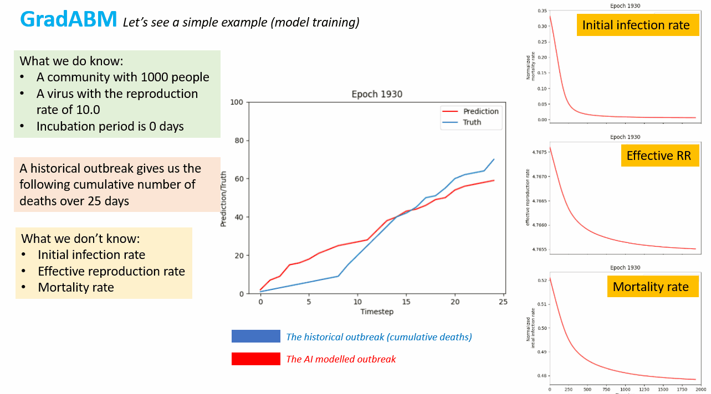

GradABM-ESR
=============

This is the implementation of the GNN-LSTM powered agent based modelling (ABM) system at ESR, this is part of the AI enabled ``Digital Twin`` project at ESR. 

_Agent Based Models (ABMs) have emerged as a powerful tool for investigating complex node interactions. In this project, we developed a tensorized and differentiable ABM that seamlessly integrates into [Pytorch Geometric](https://pytorch-geometric.readthedocs.io/en/latest/). This integration allows us to harness the power of Graph Neural Network (GNN), modern GPU units and enable the real-time and fully automatic parameter calibration by calculating the gradient of the loss function with respect to the weights of neural network through backpropagation._

Note that this approach is taking from the concept of [AgentTorch](https://github.com/AgentTorch/AgentTorch).

## 📞 **Contact**

Contact: sijin.zhang@esr.cri.nz, _Senior Data Scientist at ESR_

## 🌟 **Example**

A simple example is shown below about _how the prediction and truth fit over iterations, and how the unknown characteristics are learned during backpropagation._

<p align="center" style="margin-bottom:0">
    
</p>

The following example illustrates _how a hypothetical measles outbreak in Silverstream, Upper Hutt, could impact the revenue of the local hospitality sector._

<p align="center" style="margin-bottom:0">
    
</p>
<p align="center" style="margin-top:0">
    
    
</p>

_Another example is about how the road maintenance would affect the roadside businesses in Upper Hutt._

<p align="center" style="margin-bottom:0">
    
</p>


## 🛠️ A simple implementation

**The documentation for installing and using the package can be obtained at [here](https://june-nz.readthedocs.io/en/latest/DiffABM.html)**

The following codes give a simple workflow (with the provided test data) on how to train the GradABM model:

```
from gradabm_esr.process.input.test import load_test_data
from gradabm_esr.process.model.abm import init_abm
from gradabm_esr.process.model.diags import save_outputs
from gradabm_esr.process.model.loss_func import loss_optimization
from gradabm_esr.process.model.param import param_model_forward
from gradabm_esr.process.model.postp import postproc_train

cfg, model_inputs = load_train_input(use_test_data=True)
abm = init_abm(model_inputs, cfg)

for epi in range(abm["num_epochs"]):
    param_values_all = param_model_forward(
        abm["param_model"], model_inputs["target"]
    )
    predictions = run_gradabm_wrapper(
        abm["model"],
        param_values_all,
        abm["param_model"].param_info(),
        model_inputs["total_timesteps"],
        save_records=False,
    )

    output = postproc_train(predictions, model_inputs["target"])

    loss_optimization(
        abm["loss_def"]["loss_func"](output["y"], output["pred"]),
        abm["param_model"],
        abm["loss_def"],
        print_grad=False,
    )

```


