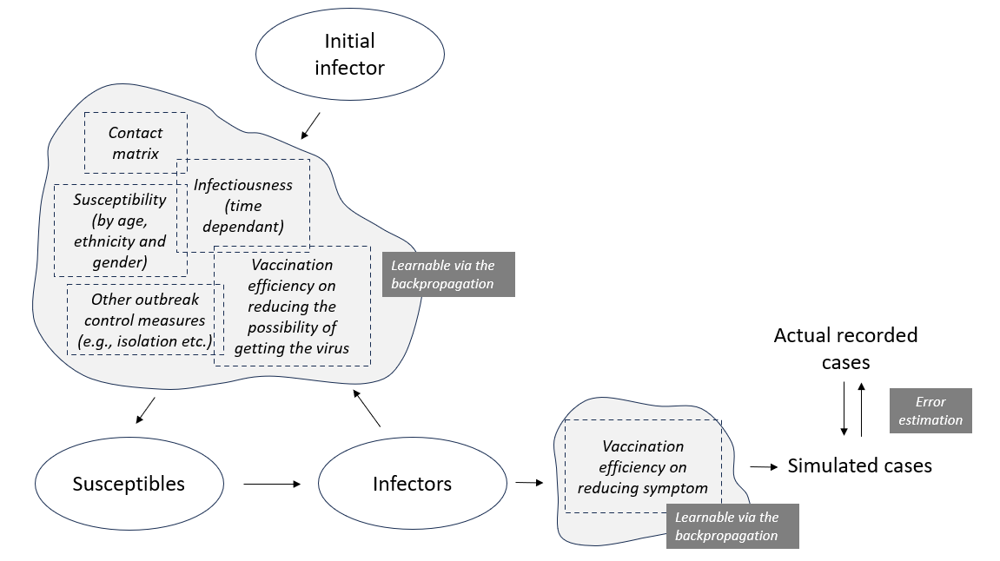
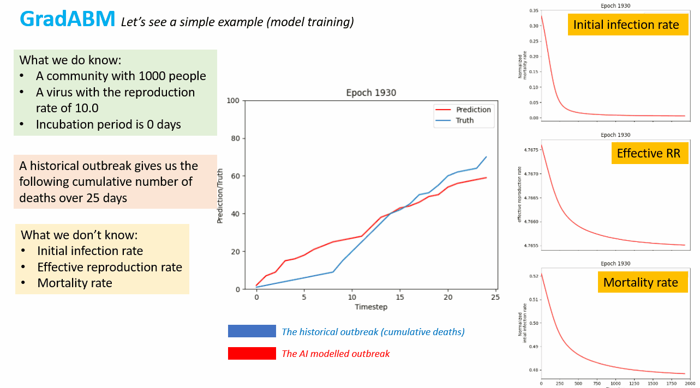

GradABM-ESR
=============

This is the implementation of the GNN-LSTM powered agent based modelling (ABM) system at ESR, this is part of the ``JUNE-NZ`` public health modelling framework at ESR. 

_Agent Based Models (ABMs) have emerged as a powerful tool for investigating complex node interactions. In this project, we developed a tensorized and differentiable ABM that seamlessly integrates into [Pytorch Geometric](https://pytorch-geometric.readthedocs.io/en/latest/). This integration allows us to harness the power of Graph Neural Network (GNN), modern GPU units and enable the real-time and fully automatic parameter calibration by calculating the gradient of the loss function with respect to the weights of neural network through backpropagation._

Note that this approach is taking from the concept of [AgentTorch](https://github.com/AgentTorch/AgentTorch).

As an example, the model is setup for investigating the measles transmission in our community:



**The documentation for installing and using the package can be obtained at [here](https://june-nz.readthedocs.io/en/latest/DiffABM.html)**

Contact: sijin.zhang@esr.cri.nz

A simple implementation
==================

The following codes give a simple workflow (with the provided test data) on how to train the GradABM model:

```
    cfg, model_inputs = load_train_input(use_test_data=True)
    abm = init_abm(model_inputs, cfg)

    for epi in range(abm["num_epochs"]):
        param_values_all = param_model_forward(
            abm["param_model"], model_inputs["target"]
        )
        predictions = run_gradabm_wrapper(
            abm["model"],
            param_values_all,
            abm["param_model"].param_info(),
            model_inputs["total_timesteps"],
            save_records=False,
        )

        output = postproc_train(predictions, model_inputs["target"])

        loss_optimization(
            abm["loss_def"]["loss_func"](output["y"], output["pred"]),
            abm["param_model"],
            abm["loss_def"],
            print_grad=False,
        )

```




