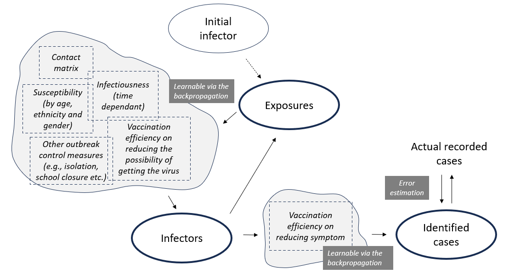

JUNE-NZ (GradABM)
=============

This is the implementation of the differentiable ABM at ESR, this is part of the ``JUNE-NZ`` public health modelling framework at ESR. 

Agent Based Models (ABMs) have emerged as a powerful tool for investigating complex social interactions, particularly in the context of public health and infectious disease investigation. In this paper, we developed a tensorized and differentiable agent-based model that seamlessly integrates into the Pytorch machine learning framework (known as JUNE-NZ). This integration allows us to harness the power of modern GPU units and enable the real-time and fully automatic parameter calibration by calculating the gradient of the loss function with respect to the weights of neural network through backpropagation. 

The model was employed to investigate the 2019 measles outbreak occurred in New Zealand, and a good skill is shown for simulating the outbreak’s peak accurately. Moreover, we extensively explored various policy interventions within the model and thoroughly examined their potential impacts.

The model setup is described below:

Contact: sijin.zhang@esr.cri.nz