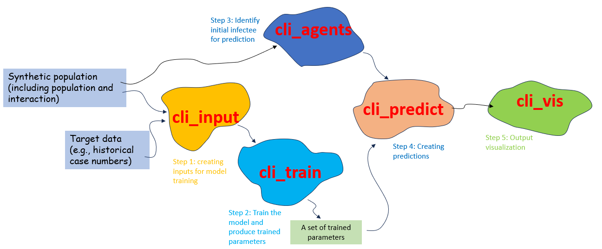

##############
Introduction
##############

**********
Background
**********

The need for improved practice 
=============

Traditional agent-based models (ABMs) are built upon object-oriented programming, defining agents and actions individually for ease of understanding and design 
(e.g., EpiModel by Emory University, a widely used model for infectious disease research). 
However, this approach demands each agent to maintain its memory, potentially causing high memory usage and 
slow computation for large-scale simulations. 
Furthermore, calibrating these models can be challenging and time-consuming due to numerous parameters, 
including unobservable ones like interaction matrices in schools or workplaces.

The new technology - GradABM
=============
To address these issues, researchers from __Oxford__ and __MIT__ have jointly developed **GradABM** 
(see the details `here <https://arxiv.org/abs/2207.09714>`_),
a new approach that uses Graph Neural Networks (GNNs) and Long Short-Term Memory (LSTM) 
to represent agents and their interactions. **GradABM** is able to simulate large populations 
of millions of agents much faster than traditional ABMs, 
and with less memory overhead. Crucially, users do not need to 
manually specify the actual values of a large number of parameters in **GradABM**. 
Instead, they can simply provide a reasonable range of values for each parameter, 
based on previous studies and empirical experience. 
The deep learning neural network will then learn the actual values of the parameters, 
taking into account the temporal evolution of social dynamics.

The adaptation for New Zealand
=============
**GradABM** was first developed to simulate how vaccines were given and their impacts during the COVID-19 pandemic in London. 
It has since been further developed in other countries such as the modelling of flu seasons in the US. 
ESR is working with international partners to incorporate the methodology of **GradABM** into the JUNE-NZ model, 
with the aim of developing a real-time risk and policy analysis tool for public health concerns. 
JUNE-NZ links to ESR's notifiable disease database, enabling seamless observation and modelling, 
and provides an external-facing dashboard that will allow end-users to run the model, using different scenarios.

**********
Software structure overview
**********
There are mainly five components in **JUNE-NZ**:

- `cli_input`: Responsible for taking synthetic population data and the observed number of cases (the target for the learning process) and converting them into a format that can be easily consumed by the system.

- `cli_train`: Handles model training and produces the trained model parameters for prediction.

- `cli_agents`: In charge of creating a single (or a cluster of) agent(s) as the initial infectee for prediction.

- `cli_predict`: Generates predictions.

- `cli_vis`: Provides visualization from the prediction.

The following figure shows the general workflow for this model:

